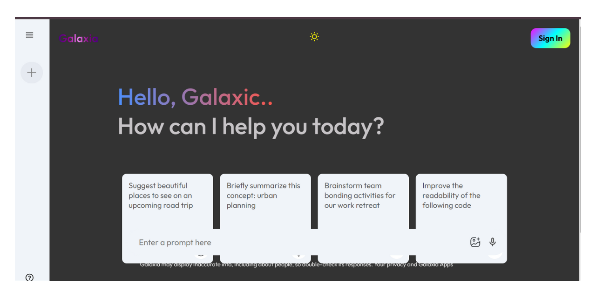

# Galaxia

**Motive**: Create a Gemini clone using the Gemini API to provide cryptocurrency data and analytics.



## Project Overview
"Galaxia" is a cryptocurrency analytics platform built as a clone of Gemini, using the Gemini API. The platform is designed to provide real-time data, analytics, and insights on various cryptocurrencies. Built with React and HTML, Galaxia offers a user-friendly interface and seamless user experience.

## Features

### Real-Time Data:
- **Cryptocurrency Prices**: Display real-time prices for various cryptocurrencies using the Gemini API.
- **Market Data**: Access detailed market data including trading volume, market cap, and price changes.

### User Interface:
- **Responsive Design**: A fully responsive design ensuring compatibility across all devices.
- **Navigation**: Easy navigation with a clear and intuitive layout.

### Cryptocurrency Details:
- **Price Charts**: Interactive price charts showing historical data and trends.
- **Detailed Information**: Detailed information on each cryptocurrency including its market performance and trading volume.

### Watchlist:
- **Add to Watchlist**: Users can add their favorite cryptocurrencies to a watchlist for quick access.
- **Watchlist Management**: Easily manage the watchlist by adding or removing cryptocurrencies.

## Technologies Used

### Gemini API:
- **Data Source**: Used to fetch real-time and historical cryptocurrency data.
- **Features**: Provides comprehensive market data and trading information.

### React.js:
- **Component-Based Architecture**: Building a modular and maintainable frontend.
- **State Management**: Efficient state management using hooks and context API.

### HTML & CSS:
- **Markup**: Structuring the web pages using HTML.
- **Styling**: Inline CSS for styling the components.
- **Responsive Design**: Ensuring the website looks great on all screen sizes.

## How to Run the Project

### Clone the repository:
```bash
git clone https://github.com/your-username/galaxia.git
cd galaxia

